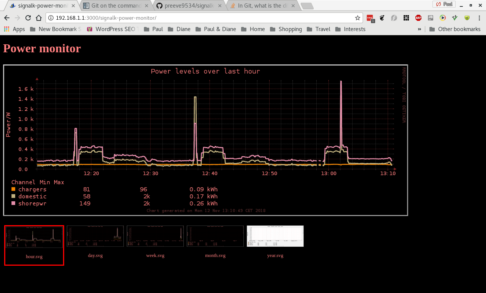
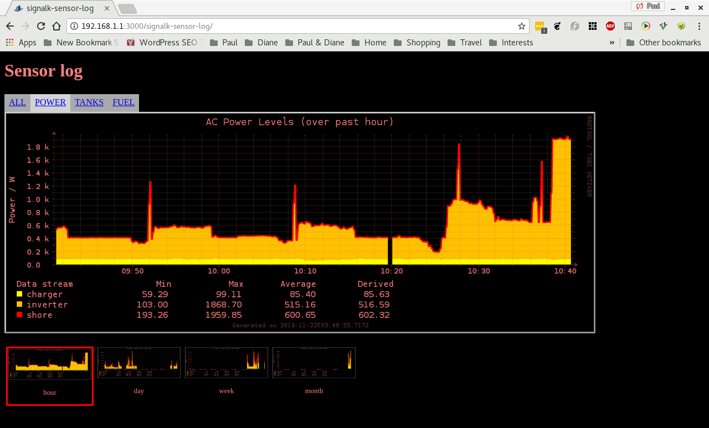
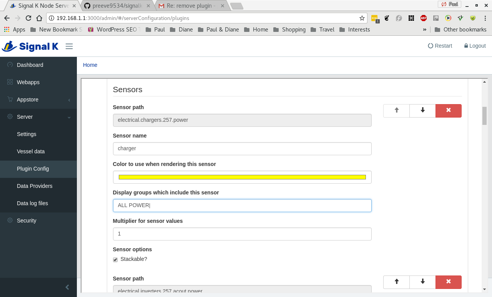
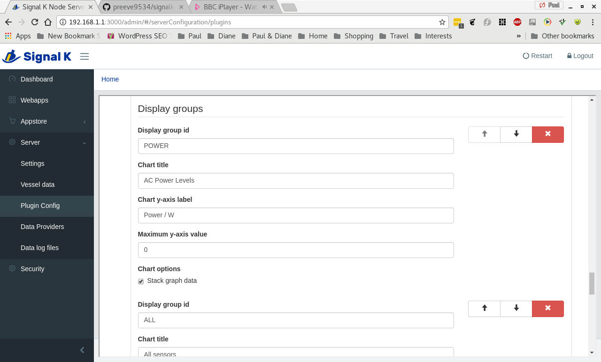

# signalk-sensor-log

Log time series sensor data.

__signalk-sensor-log__ logs sensor readings from the host Signal K Node server
as time-series data in a round-robin database.
Logged data can be collated as a _display group_  consisting of charts which
depict the selected stored readings over a range of historic timescales.

Some examples of the type of data logging that can be undertaken are illustrated
below. 

__Example 1__  
_currentLevel_ data value from the system's tank data sensore can be logged to
show changes in tank levels over time.

__Example 2__  
Power levels reported from the host vessel's inverter/charger can be logged to
show changes in electrical power consumption and use.

__Example 3__
Readings from the echo sounder are plotted to illustrate changes in the depth
of the sea-bed over time.

## System requirements

1. Sufficient storage to hold the round-robin database and the generated image
   files.
   Each monitored data channel requires around 4MB of database storage and
   there is a small system overhead of about 2MB.
   Each chart group consists of five SVG image files which in total occupy
   about 0.6MB.

2. [RRDtool](https://oss.oetiker.ch/rrdtool/).
   This application is part of most Linux distibutions.

## Installation

1. If you don't have it already, install __rrdtool__ on your Signal K Node
   server host.
   Use your system's package manager, or download and install a suitable version
   from the
   [RRDtool download page](https://oss.oetiker.ch/rrdtool/download.en.html).

2. Download and install __signalk-sensor-log__ using the _Appstore_ link
   in your Signal K Node server console.
   The plugin can also be downloaded from the
   [project homepage](https://github.com/preeve9534/signalk-sensor-log)
   and installed using
   [these instructions](https://github.com/SignalK/signalk-server-node/blob/master/SERVERPLUGINS.md).

## Usage

### Running the plugin for the first time

In the server main menu navigate to _Server->Plugin config_ and select _Sensor
Log_to access the plugin configuration screen.

When opened for the first time the configuration page will be populated with
an entry for every sensor registered on the host Signal K server.
Most likely you will not want to monitor all of these: indeed some will most
likely carry no data and the chances are that you will not know which these
are!

A reasonable strategy immediately after installation is to allow the plugin to
run with its default configuration for a while and then review and probably
prune the list of monitored sensors before re-initialising the plugin database
so that it only logs the data you are interested in.

To achieve this, check the _Active_ option (at the top of the configuration
form) and the option _Report power levels to console_ before clicking the
_Submit_ button (at the bottom of the configuration form).

The plugin should now be listed on the Signal K Node server _Dashboard_ where
a status message will indicate that stream data is being processed.

After ten minutes or so, navigate to _Webapps_ and open the
_Signalk-Power-Monitor_ application in order to review harvested data and make
some choices about what you do and do not need to keep track of.

### Configuring the plugin data inputs

Once you are confident about the data streams you need to process, return to
the plugin configuration page and delete any redundant entries from the list
of _Power sensors_.

It is a good idea at this stage to give each of the remaining sensors a
meaningful name that can be used in graphical display.

If you have deleted any redundant data streams, then you may wish to check
the _Recreate database_ option and so recover a little bit of disk space.

### Configuring graphical output

By default the plugin generates a set of five charts which use a simple line
graph to illustrate power use for all of the monitored sensor streams over the
past hour, day, week, month and year.

My installation is based around a Victron Quattro inverter/charger and on
shore-power the device reports three sensor streams: power output to the
battery charger, power output to the inverter and power input to the system.
The default chart looks like this.

In some ways, the power input value is just clutter and a chart which displayed
the two output sensor values stacked on top of one another is a simpler and,
arguably, more meaningful way of rendering this data.
This type of chart can be achieved by checking the _Stack_ option on the two
output sensor channels.
The resulting chart looks like this.

Be aware that the when a chart is generated sensor streams are plotted in the
order in which they appear in the sensor list: you may want to re-order the
list of sensors so that the chart displays things in the most attractive way.

Otherwise, continue by reviewing the screen options (all of which are
described below) making changes which match your requirement.
When you are satisfied, check click _Submit_.

### Configuration options

#### General configuration options

__Database pathname__  
Specifies the pathname used for the plugin's round-robin database.
The default behaviour is to create a file called `database.rrd` in the plugin
install directory.

If you change this value the plugin will immediately begin using the specified
database, automatically creating a new one if the named database does not
exist.
Note that if you specify a pathname outside the plugin install directory, then
you must make sure that the directory path exists and has appropriate access
permissions to allow the database to be created and updated by the owner of
the executing Signal K Node server.

__Database update interval__  
Species the frequency in seconds at which data should be sampled from the host
system and written to the database.
The default value is 10 seconds and this is probably close to the highest
practical update frequency on most systems.

If you change this value after initial configuration the plugin will delete
the existing database and create a new one.

__Database advanced options__  
If checked, these options are applied once when the _Submit_ button is clicked.

    __Regenerate database__  
    Deletes the existing database and creates a new one using the current
    option settings.
    
    __Re-initialise database__  
    Deletes the existing database, re-builds the plugin's _Sensor list_ from
    the Signal K Node server's list of available channels and creates a new 
    database capable of holding the whole sensor set.
    No option settings other than the _Sensor list_ are changed.
    
__Chart directory__  
Specifies the directory where the plugin will create its charts.
The default behaviour is to store charts in the
`_plugin_install_directory_/public/` folder.

You can change this location, but the new location must have permissions which
will allow files to be created and updated by the owner of the executing Signal
K Node server.
Also note that the plugin webapp (see below) expects its charts to be available
in the default location.

Setting this option to the empty string will disable chart generation.

__Report database updates to console__  
Specifies whether or not the plugin should issue a terse summary of the data
values being written to the database each time an update occurs.
The default behaviour is not to report in this way.

#### Sensor configuration options  

Each sensor is defined by the following options.

__Sensor path__  
Shows the Signal K data path identifying this sensor.
The value shown is generated by the server and cannot be changed.

__Sensor name__  
Specifies the name to use for this sensor in all display contexts.
The default value is a probably unique, possibly inscrutable, token derived
from the sensor path.
You will probably want to change this into something more meaningful.

__Color to use when rendering this sensor__  
Specifies the color to be used when rendering this sensor's data on a chart.
The default value is sequentially selected from a palette of twenty easily
differentiated colors.

__Display groups which include this sensor__  
Specifies a space-separated list of display groups which include this sensor.
By default, all sensors are assigned to the display group ALL.
If you enter the name of a non-existant display greoup, then the plugin will
automatically create a new display group (this will not appear in the plugin
configuration screen until _Submit_ has been clicked to commit the change).

__Multiplier for sensor values__  
Specifies a multiplication factor which should be applied to this sensor's
data values.
The default value is 1 (i.e. sensor values are unchanged).
If you prefer values which are reported as ratios to be handled as percentages
then set the sensor multiplier to 100.

__Sensor options --> Stackable__  
Specifies whether or not the data from this sensor could reasonably be
stacked with other values in a chart.
The default value is true.
Note that setting this option only specifies whether or not the associated
data can be stacked, a _Display group_ option (see below) will determine
whether or not the sensor data is rendered in this way on an output chart.
You can uncheck this option  to ensure that a sensor value which is
inherently discrete cannot be rendered in a misleading way.

#### Display group configuration options
    

Each display group is defined by the following options.

__Display group id__  

__Chart title__  

__Chart y-axis label__  

__Maximum y-axis value__  

__Chart options --> Stack graph data__  

## Notifications, warnings and errors

## Version history

## License

__signalk-tank-monitor__ is released under Apache License 2.0.

__Example 3__  
available in the
Signal K Node server's electrical data set.
Electrical power reeadings are harvested from the host Signal K Node server and
stored in a round-robin database (in my case, the monitored data originates
from a Victron Quattro 8000 and is injected into Signal K by the
[__signalk-venus-plugin__](https://www.npmjs.com/package/signalk-venus-plugin)).

Periodically data from the database is used to generate graphs which illustrate
the changes in power usage over time.
The plugin makes an attempt to derive kWh energy usage from the reported power
readings.

