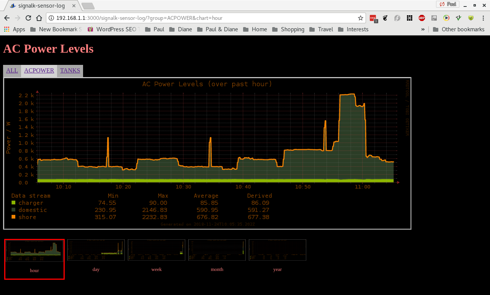
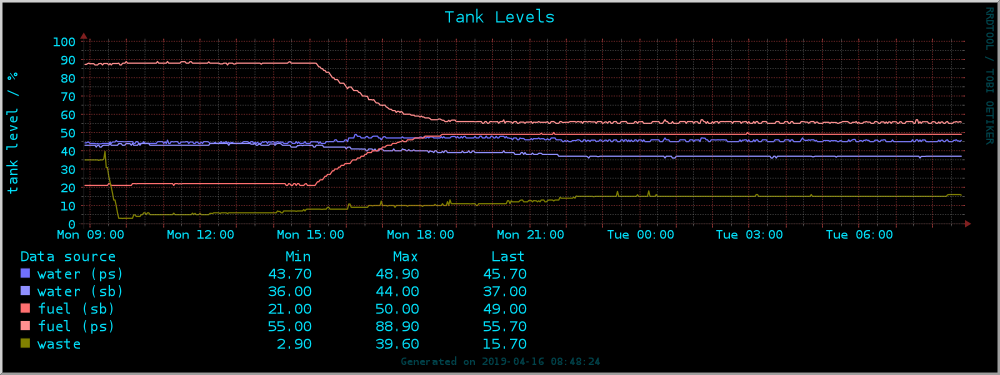
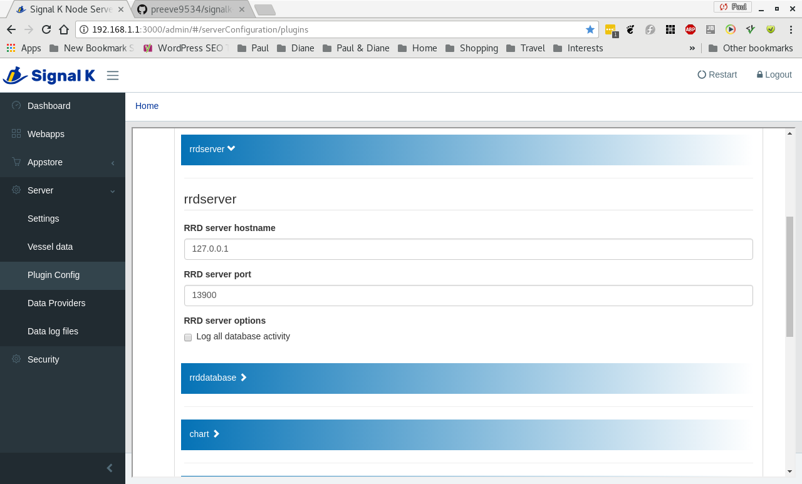
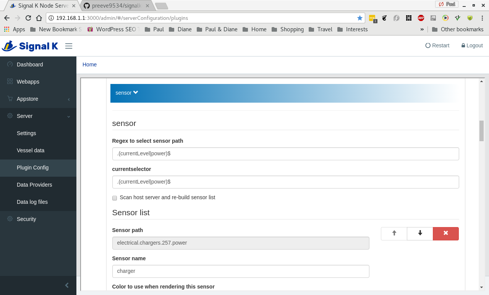

# signalk-sensor-log

Log and chart sensor data using round-robin databases.

At a regular, user-defined, sampling _interval_ __signalk-sensor-log__
retrieves a set of user selected path _values_ from the host Signal K Node
server and saves each of these values into a collection of round-robin
_databases_.

By default, the plugin consolodates stored data over hour, day, week, month
and year timescales in a way which prevents database expansion at the expense
of some loss of detail at larger timescales.

Data derived from each path can be rendered as part of one or more chart
collections (a chart collection is just a set of charts which depict the same
data values over each of the defined timescales).

The plugin includes a simple web application which can be used to display any
generated charts.

Database update and rendering services are implemented as stand-alone daemons
which have minimal impact upon server operation even when many sensor channels
are being monitored.

The plugin offers a range of user configuration options, but is designed to
work 'out of the box' in a way that may suit many users.

Some examples of the type of data logging that can be undertaken are
illustrated below.

__Example 1__  
Power levels reported from the host vessel's inverter/charger show changes in
electrical power consumption and use.



__Example 2__
Readings from tank level sensors are plotted to illustrate changes in tank
content over time.



__Example 3__
NMEA switchbank state changes over time.

## Overview and system requirements

__signalk-sensor-log__ uses the
[RRDtool](https://oss.oetiker.ch/rrdtool/)
database management system, using both the __rrdtool__ and  __rrdcached__
applications.
The plugin includes a standalone chart generator implemented in Python which
requires a free TCP socket.
The host machine must implement __systemd__.

Against this background, use of __signalk-sensor-log__ requires:

1. __rrdtool__ (part of most Linux distributions).

2. __rrdcached__ (also part of most Linux distribuions).

3. Sufficient storage to hold the round-robin database and the generated image
   files.
   Each monitored data channel requires around 4MB of database storage and
   there is a small system overhead of about 2MB.
   Each chart group consists of five SVG image files which in total occupy
   about 0.6MB.

## Installation

1. Download and install __rrdtool__ and __rrdcached__ using your operating
   system's package manager.
   On my system `sudo apt-get install rrdtool rrdcached` does the trick.

2. Download and install __signalk-sensor-log__ using the _Appstore_ link
   in your Signal K Node server console.
   The plugin can also be downloaded from the
   [project homepage](https://github.com/preeve9534/signalk-sensor-log)
   and installed using
   [these instructions](https://github.com/SignalK/signalk-server-node/blob/master/SERVERPLUGINS.md).

2. Change to the __signalk-sensor-log__ install directory.
   The command `cd ~/.signalk/node_modules/signalk-sensor-log` should do this
   if you are logged in as _root_. 

3. Use your favourite editor to review and, if necessary, amend the service
   configuration file `systemd/services.conf`.
   The file is commented to give guidance on what changes may be required -
   although in most situations, no changes will be necessary.

4. Execute the command `bash configure.sh` which will simply create the file
   `install.sh`.
   It is this script which will install the two supporting services by:

   1. Creating a new system user and group rrd:rrd by modifying `/etc/passwd`
      and `/etc/group` using the `useradd` command.
   2. Creating a working directory (`/var/rrd/`) for the update service and a
      sub-directory (`var/rrd/signalk-sensor-log/`) for the chart generation
      service, both owned by the rrd:rrd user.
   3. Creating links in `/etc/systemd/system/` which point to the configuration
      files in the plugin's `systemd` folder.
   4. Executing `systemctl daemon-reload` to register the changes made at (3).

5. If you are happy to modify your system in this way, then execute the command
   `bash install.sh`.
      
That's it.
You can now proceed to the next section which describes configuring and using
 __signalk-sensor-log__.
## Installation

1. Download and install __rrdtool__ and __rrdcached__ using your operating
   system's package manager.
   On my system `sudo apt-get install rrdtool rrdcached` does the trick.

2. Download and install __signalk-sensor-log__ using the _Appstore_ link
   in your Signal K Node server console.

   The plugin can also be downloaded from the
   [project homepage](https://github.com/preeve9534/signalk-sensor-log)
   and installed using
   [these instructions](https://github.com/SignalK/signalk-server-node/blob/master/SERVERPLUGINS.md).

3. Change to the __signalk-sensor-log__ install directory.
   The command `cd ~/.signalk/node_modules/signalk-sensor-log` should do this
   if you are logged in as _root_. 

4. Use your favourite editor to review and, if necessary, amend the service
   configuration file `systemd/services.conf`.

   The default file defines eight variables in the following way.
   ```
   RRD_USER=rrd
   RRD_GROUP=rrd
   RRDCACHED_WORKING_DIRECTORY=/var/rrd/signalk-sensor-log
   RRDCACHED_SOCKET=rrdcached.sock
   RRDCACHED_PID=rrdcached.pid
   RRDCHARTD_WORKING_DIRECTORY=/var/rrd/signalk-sensor-log/charts
   RRDCHARTD_PORT=9999
   RRDCHARTD_CONFIG_FILE=/root/.signalk/plugin-config-data/sensor-log.json
   ```
   The file is commented to give guidance on the purpose of each variable and
   what changes, if any, may be considered or required.

5. Execute the command `sudo bash ./systemd/install.sh`.

   This script copies unit files into the `/etc/systemd/system/` directory
   and installs and starts __rrdcached__ and  __rrdchartd__.
   These changes can be reversed by `sudo bash ./systemd/install.sh -u`.


## Usage

__signalk-sensor-log__ will not run until it has been activated from its
plugin configuration panel in the Signal K Node server console (see below).

When the configuration panel is opened for the first time the plugin will
acquire all available data sources from the host Signal K Node server and
present these for user review before instantiating any databases.

Editing of the acquired data sources is optional but advisable for the
following reasons:

1. There may be very many data sources and reducing this number reduces the
workload placed on the host system.
For example, on my modestly equipped vessel Signal K generates several hundred
data sources many of which are of no substantive interest (for example, some
paths return constant values reporting tank capacity whilst others return
undefined or text values).

2. RRDTool and __signalk-sensor-log__ are optimised for handling integer data
sources and some Signal K data will need factoring up in order to be logged
in a meaningful way.
For example, Signal K reports tank capacities as decimal ratios in the range
0.0 to 1.0: factoring these up by 100 gives a percentage which can be better
handled by the logging system.

Whilst it is sensible on first execution prune the data source list to suit
your own installation requirement it may be wise not to prune too aggressively.
Having a little-used data source available in a database for plotting is much
better than having to re-initialise a database so that it can accommodate a
data source that was never recorded in the first place.

### Activating the plugin for the first time

In the server main menu navigate to _Server->Plugin config_ and select _Sensor
Log_to open the __signalk-sensor-log__ configuration panel.

The configuration panel consist of a Signal K Node server widget containing
_Active_ and _Debug log_ options, three plugin specific configuration tabs
(labelled _Data sources_, _Display groups_ and _Advanced options_), and
finally a _Submit_ button which saves the plugin configuration, commits any
changes and starts or stops the plugin dependent upon the state of the
_Active_ option.

To activate the plugin you must check the _Active_ option and click _Submit_,
but, given the discussion above, you may prefer to review and adjust the
contents of the _Data sources_ tab before doing this.

### _Data sources_ configuration options

Selecting the _Data sources_ tab expands (and collapses) an alphabetically
sorted list of the data sources which the plugin will log.

Individual data sources can be deleted using the __[x]__ button and new sources
added using the __[+]__ button.
On an already executing plugin, it is possible to re-scan the host Signal K
server and re-build the entire list of data sources using one of the _RRD
database_ configuration options.

Options available for each entry are:

__path__  
The Signal K path identifying the data source.

__multiplier__  
An interger multiplier which will be applied to every value read from the data
source before it is saved in a database.
 
__Chart groups__  
A space separated list of the names of the display groups which should render
this data source.
Display group names must be alphanumeric strings, containing no punctuation or
whitespace characters.
The plugin will automatically create configuration entries under the _Display
groups_ tab for all named groups.
 
### _Display groups_ configuration options

Selecting the _Display groups_ tab expands (and collapses) a list of display
groups as identified by all the __Display groups__ options in each data source.
Entries in this list appear when they are mentioned in a data source and
disappear when all references to them are removed.

Options available for each entry are:

__Group name__  
The name of the chart group (not editable).
This derives from a value in the _Chart groups_ option of entries in the
_Data sources_ list.

__Chart title__  
Text to be used as a title for all charts in this group.

__Y-axis label__  
Text to be used a the y-axis label for all charts in this group.

__Min value__  
Y-axis minimum value.
If this option is left blank the y-axis minimum value will scale automatically.

__Max value__  
Y-axis maximum value.
If this option is left blank the y-axis maximum value will scale automatically.

__Options->Trace__  
Spread all data source values across the y-axis to give an EEG-style render.
Useful for monitoring things like switchbank channel state changes.

__Options->Min__  
Display legends as a table and add a column showing the minimum value of all
data sources.

__Options->Max__  
Display legends as a table and add a column showing the maximum value of all
data sources.

__Options->Avg__  
Display legends as a table and add a column showing the mean value of all
data sources.

__Options->Derived__  
Display legends as a table and add a column showing the integral value of all
traces.

__Options->Last__  
Display legends as a table and add a column showing the most recent value of all
traces.

__Data sources__

This option lists each data source that has been assigned to this display group.
The order of items in the list can be shuffled using the sidebar controls: data
sources are rendered top down (this is significant when data sources are
stacked (see below)).

Options available for each data source are:

__path__  
The path name of the data source (this value cannot be changed).

__name__  
The name to be used when rendering the data source.
The default value is a mangled version of the data source path name.

__color__  
The color to be used when rendering the data source.

__options->area__  
Data sources are normally plotted as a line, but this will render the data as
an area - may be useful with...

__options->stack__  
Data source will be stacked on top of previously rendered, stacked, data
sources.

### Advanced configuration options

### rrdservices configuration tab

### rrddatabase configuration tab
The primary configuration option is contained in the _sensor_ sub-section and
is a regular expression (or regex) which of all the available Signal K sensor
paths are of interest to the plugin.
and opening this will reveal o
Proceed with first configuration by:

1. Expand the _rrdservices_ configuration tab and confirm that the service
   connection settings conform to the connection
1. Expand the _rrdserver_ configuration tab and confirm that the server
   connection details correspond with the service configuration you
   implemented in the previous section.

   

   Make any necessary changes and close the tab.

2. Expand the _sensor_ tab.
   
   

   __signalk-sensor-log__ defaults to attempting to recover tank level and
   electrical power data streams from the Signal K Node server.
   If your system has this data available, then you will see a list of the
   detected electrical and tank sensors; if this data is not available on
   your system or you are interested not in it, but in something else, then
   you need to modify the value of the option _Regex to select sensor paths_.

   Any
   [regular exression]()
   supplied in this field will be used to filter the list of available sensor
   paths returned by the Signal K Node server into the list that will form the
   basis of __signalk-sensor-log__'s processing. 
   You can review the server's comprehensive list by pointing your browser at
   `http://_your_server_address_:_your_server_port_/signalk/v1/api/vessels/self/`.

   The selection you make here only needs to be approximate: individual sensor
   paths can be pruned at a later stage.
   If you wish, you can simply enter ".*" as the regular expression and grab
   all of the available sensor data.


When opened for the first time the configuration page will be populated with
an entry for every sensor registered on the host Signal K server.
Most likely you will not want to monitor all of these: indeed some will most
likely carry no data and the chances are that you will not know which these
are!

A reasonable strategy immediately after installation is to allow the plugin to
run with its default configuration for a while and then review and probably
prune the list of monitored sensors before re-initialising the plugin database
so that it only logs the data you are interested in.

To achieve this, check the _Active_ option (at the top of the configuration
form) and the option _Report power levels to console_ before clicking the
_Submit_ button (at the bottom of the configuration form).

The plugin should now be listed on the Signal K Node server _Dashboard_ where
a status message will indicate that stream data is being processed.

After ten minutes or so, navigate to _Webapps_ and open the
_Signalk-Power-Monitor_ application in order to review harvested data and make
some choices about what you do and do not need to keep track of.

### Configuring the plugin data inputs

Once you are confident about the data streams you need to process, return to
the plugin configuration page and delete any redundant entries from the list
of _Power sensors_.

It is a good idea at this stage to give each of the remaining sensors a
meaningful name that can be used in graphical display.

If you have deleted any redundant data streams, then you may wish to check
the _Recreate database_ option and so recover a little bit of disk space.

### Configuring graphical output

By default the plugin generates a set of five charts which use a simple line
graph to illustrate power use for all of the monitored sensor streams over the
past hour, day, week, month and year.

My installation is based around a Victron Quattro inverter/charger and on
shore-power the device reports three sensor streams: power output to the
battery charger, power output to the inverter and power input to the system.
The default chart looks like this.


In some ways, the power input value is just clutter and a chart which displayed
the two output sensor values stacked on top of one another is a simpler and,
arguably, more meaningful way of rendering this data.
This type of chart can be achieved by checking the _Stack_ option on the two
output sensor channels.
The resulting chart looks like this.


Be aware that the when a chart is generated sensor streams are plotted in the
order in which they appear in the sensor list: you may want to re-order the
list of sensors so that the chart displays things in the most attractive way.

Otherwise, continue by reviewing the screen options (all of which are
described below) making changes which match your requirement.
When you are satisfied, check click _Submit_.

### Plugin configuration

#### systemd/service.conf

__signalk-sensor-log__ interacts with two stand-alone service daemons and
inevitably there is a handful of configuration settings which must be shared.
These shared settings are held in the file `systemd/service.conf` which is
read by both __systemd__ (as it starts __rrdcached__ and __rrdchartd__) and
the plugin.

Settings in `systemd/service.conf` are fully documented through comments in the
file itself and these values must be reviewed and changed if necessary as part
of plugin commissioning.

#### Configuration through Signal K Node 


#### General configuration options

__Database pathname__  
Specifies the pathname used for the plugin's round-robin database.
The default behaviour is to create a file called `database.rrd` in the plugin
install directory.

If you change this value the plugin will immediately begin using the specified
database, automatically creating a new one if the named database does not
exist.
Note that if you specify a pathname outside the plugin install directory, then
you must make sure that the directory path exists and has appropriate access
permissions to allow the database to be created and updated by the owner of
the executing Signal K Node server.

__Database update interval__  
Species the frequency in seconds at which data should be sampled from the host
system and written to the database.
The default value is 10 seconds and this is probably close to the highest
practical update frequency on most systems.

If you change this value after initial configuration the plugin will delete
the existing database and create a new one.

__Database advanced options__  
If checked, these options are applied once when the _Submit_ button is clicked.

    __Regenerate database__  
    Deletes the existing database and creates a new one using the current
    option settings.
    
    __Re-initialise database__  
    Deletes the existing database, re-builds the plugin's _Sensor list_ from
    the Signal K Node server's list of available channels and creates a new 
    database capable of holding the whole sensor set.
    No option settings other than the _Sensor list_ are changed.
    
__Chart directory__  
Specifies the directory where the plugin will create its charts.
The default behaviour is to store charts in the
`_plugin_install_directory_/public/` folder.

You can change this location, but the new location must have permissions which
will allow files to be created and updated by the owner of the executing Signal
K Node server.
Also note that the plugin webapp (see below) expects its charts to be available
in the default location.

Setting this option to the empty string will disable chart generation.

__Report database updates to console__  
Specifies whether or not the plugin should issue a terse summary of the data
values being written to the database each time an update occurs.
The default behaviour is not to report in this way.

### Sensors


The _Sensors_ configuration consists of a list of sensors identified by the
plugin.
Each sensor in the list is configured by the following set of options.

__Sensor path__  
Shows the Signal K data path identifying this sensor.
The value shown is generated by the server and cannot be changed.

__Sensor name__  
Specifies the name to use for this sensor in all display contexts.
The default value is a probably unique, possibly inscrutable, token derived
from the sensor path.
You will probably want to change this into something more meaningful.

__Color to use when rendering this sensor__  
Specifies the color to be used when rendering this sensor's data on a chart.
The default value is sequentially selected from a palette of twenty easily
differentiated colors.

__Display groups which include this sensor__  
Specifies a space-separated list of display groups which include this sensor.
By default, all sensors are assigned to the display group ALL.
If you enter the name of a non-existant display greoup, then the plugin will
automatically create a new display group (this will not appear in the plugin
configuration screen until _Submit_ has been clicked to commit the change).

__Multiplier for sensor values__  
Specifies a multiplication factor which should be applied to this sensor's
data values.
The default value is 1 (i.e. sensor values are unchanged).
If you prefer values which are reported as ratios to be handled as percentages
then set the sensor multiplier to 100.

__Sensor options --> Stackable__  
Specifies whether or not the data from this sensor could reasonably be
stacked with other values in a chart.
The default value is true.
Note that setting this option only specifies whether or not the associated
data can be stacked, a _Display group_ option (see below) will determine
whether or not the sensor data is rendered in this way on an output chart.
You can uncheck this option  to ensure that a sensor value which is
inherently discrete cannot be rendered in a misleading way.

### Display groups


This _Display groups_ configuration consists of a list of display group entries
creates dynamically from the display group names supplied in the _Sensors_
configuration.
Each display group in the list is configured by the following options.

__Display group id__  
Specifies a unique identifier for this display group.
This value is created by the plugin from a display group identifier specified
in the _Sensors_ list and cannot be changed.

__Chart title__  
Specifies a title to be used for this display group's webpage and in each of
the generated charts.
Default value is something innocuous.
You will probably want to change this.

__Chart y-axis label__  
Specifies the text to be used as a label on the vertical axis of charts in this
display group.
Default value is something innocuous.
You will probably want to change this to something that describes at least the
units of the displayed data.

__Maximum y-axis value__  
Specifies the maximum value that can be displayed on the the y-axis.
The default value of 0 (zero) indicates that the axis should be automatically
scaled in response to the maximum value in the displayed data.

__Chart options --> Stack graph data__  
When checked, selects a stacked-area chart rather than a line graph.
Defaults to unchecked.
All data values included in the display group will be stacked except for those which
are marked in the _Sensors_ configuration as not stackable.

## Notifications, warnings and errors

## Version history

## License

__signalk-tank-monitor__ is released under Apache License 2.0.


__Example 3__  
available in the
Signal K Node server's electrical data set.
Electrical power reeadings are harvested from the host Signal K Node server and
stored in a round-robin database (in my case, the monitored data originates
from a Victron Quattro 8000 and is injected into Signal K by the
[__signalk-venus-plugin__](https://www.npmjs.com/package/signalk-venus-plugin)).

Periodically data from the database is used to generate graphs which illustrate
the changes in power usage over time.
The plugin makes an attempt to derive kWh energy usage from the reported power
readings.

## Plugin configuration options

### RRD services

__RRD cache daemon service socket__ (read only)  
Displays the UNIX socket on which __rrdcached__ is providing database creation
and update services.
This value is defined in `systemd/service.conf`.

__RRD chart generation daemon service port__ (read only)  
Displays the TCP port on which __rrdchartd__ is providing chart rendering
services.
This value is defined in `systemd/service.conf`.

### RRD database options

__Directory in which to store RRD databases__ (read only)  
Displays the directory in which all databases associated with the plugin are
stored.
This value is defined in `systemd/service.conf`.

__Database update interval in seconds__  
Defines the number of seconds between database updates and hence the frequency
at which sensor channels on the host Signal K server are sampled.
The default value is 10 seconds.
Decreasing this value much below its default may render the logging system
unstable - mileage depends principally upon resource availability on the host.

__RRD database options__  

__&x2610; Plug data holes__  
Replace missing values in the data samples with a copy of the last real value.
Default value is NO.

__&x2610; Recreate databases if plugin list changes__  
If the sensor list is updated in a way which would modify the structure of
an existing database or databases, or require the creation of a new database,
then silently implement the necessary changes.
Default value is YES.

__&x2610; Recreate all databases now__  
Recreate all databases immediately.
Default value is NO.
Note that this is a one-shot option which will reset to the default after
restart.

### Chart options

__&x2610; Generate charts__  
Make the plugin generate charts at regular intervals.
Default is YES.
If you disable this option the plugin will never generate a chart: this might
be both useful and efficient if you are able to generate charts on demand by
calling __rrdchartd__ directly (see below for details on how to do this).

__Directory for generated charts__ (read only)  
Displays the directory in which __rrdchartd__ will place rendered charts.
This value is defined in `systemd/service.conf`.

__Color to use for chart canvas__
RGB color to use for the canvas on all rendered charts.
Default is #000000 (black).

__Color to use for chart background__
RGB color to use for the background on all rendered charts.
Default is #000000 (black).

__Color to use for chart foreground__
RGB color to use for the foreground on all rendered charts.
Default is #804040 (dull red).

### Logging options

The plugin can log details of its operation, both normal and abnormal, to
either or both of the system logging service (usually to `/var/log/syslog`)
and the Signal K Node server console.
All output messages are described below in the __Log messages__ section.

These options allow control over what messages are generated where.

__Report the following events to Signal K server console__  

__&x2610; Database updates__
Default value is YES.

__&x2610; Notifications__  
Default value is YES.

__&x2610; Warnings__  
Default value is NO.

__&x2610; Errors__  
Default value is YES.

__Report the following events to the system log__  

__&x2610; Database updates__
Default value is NO.

__&x2610; Notifications__  
Default value is NO.

__&x2610; Warnings__  
Default value is YES.

__&x2610; Errors__  
Default value is YES.

### Sensors

__Initialise sensor list using this regex__  
A regular expression which is used to select the Signal K paths that are
used to initialise the plugin.
Default value is __*__ (to select all paths).
You will probably want to change the default to suit your requirement.
Changing this value will result in the sensor list being re-initialised: if the
new list contains sensor paths from the old list then the settings for
individual sensors will be carried over, but if the new list doesn't contain
any existing sensors then all the previous settings will be lost.
Note that once a sensor list has been built it can be pruned by hand ands
changes will not be overwritten until either the regex is changed or the
following option is used to force a re-scan of the server.

__&x2610; Re-initialise sensor list now__  
Forces the sensor list to be re-built (use this option to rebuild the sensor
list by re-applying the same regex).
Default value is NO.
Note that this is a one-shot option which will reset to the default after
restart.

__Sensor list__  

__&#xbb; Sensor path__   
Displays the Signal K pathname of this sensor.
This value is a unique identifier supplied by the Signal K server and cannot
be changed.

__&#xbb; Sensor name__  
A user-friendly name to be used for this sensor in all output generated by
the plugin.
Default value is a mangled version of the sensor path and you will almost
certainly want to change it.

__&#xbb; Multiplier for sensor values__  
A multiplier that will be used to scale values reported by Signal K for this
sensor before they are written to a database.
The database engine used by the plugin is tuned for handling integer values
and to exploit this Signal K values which are returned as small decimal values
will need to be scaled.
This especially impacts values like tank levels which are returned as ratios
in the range 0..1: a simple solution in this case is to use a mutiplier of
100 to yield a percentage.
Default value is 1.

__&#xbb; Databases which include this sensor__  
A space separated list of database names which should include this sensor's
data.
Default value is a name derived from the first part of the sensor's path
which ensures, for example, that all tank level data ends up in at least the
database `tanks.rrd`.

__&#xbb; Display groups which include this sensor__  
A space separated list of display groups which should include this sensor's
data.
Default value is a name derived from the first part of the sensor's path
which ensures, for example, that all tank level data ends up in at least the
display group `tanks`.

__&#xbb; Color to use when rendering this sensor__  
The color to be used for this sensor's data in all chart output.
Default is value drawn sequentially from a palette of colours designed to be
easily distinguishable one from another.
The assigned colors have no mnemonic or semantic value.

__&#xbb; Sensor options__  

__&x2610; Is stackable__  
Asserts whether or not the data associated with this sensor could be stacked
in a meaningful way in a _stacked chart_: this does not mean that the data
will be stacked, just that it could be.
Default value is NO.
## Log messages

__signalk-sensor-log__ generates three type of message: _Notifications_ are
just life-cycle advisories about what is happening, _Warnings_ let you know
that something has occurred or been identified which is a little unusual and
_Errors_ tell you that something fatal has happened or been identified and
that the plugin is terminating.

### Notifications

__Scanning server for sensor data streams__  
The plugin is requesting a list of sensor paths from the host Signal K server which it will filter using the regex supplied as a configuration option.

__Scan selected _nn_ streams__  
Application of the regex has selected _nn_ sensor paths from those supplied by the Signal K Node server.

__Creating new database '_dbname_' for _nn_ sensors__  
The plugin is creating a new database called _dbname_ to hold data for _nn_ sensor streams.

__Updating display groups__  
The plugin is updating the list of display groups by scanning the sensor list.

__Chart generation disabled by configuration option__  
The plugin will not generate any charts because the user has disabled chart generation.

__There are no defined display groups__  
Chart generation is enabled but no charts will be generated because there are no defined display groups.

__Connected to _nn_ sensor streams__  
The plugin has connected to _nn_ sensor streams and is about to begin logging data.

__Logging _nn_ sensor streams (_v1_,_v2_,...)__  
The plugin is processing _nn_ data values (_v1_, _v2_, etc.) to database.

### Warnings

__Update of chart manifest failed__  
The plugin was unable to update `public/manifest.json`.
This probably means that the webapp will not work correctly.
This is only likely to happen if the permissions on the `public/` directory
have changed or there is no space left on the host storage device.

__Update of plugin options failed: _msg__  
The plugin asked the host Signal K Node server to update its configuration
file and the server returned an error described by _msg_.

__Updating _dbname_  with (_v1_,_v2_,...)__  

__Database update failed: _err__

__Chart generation failed for '_group_, _chart_ '__  

### Errors

__There are no accessible sensor data streams__  
This means either that the Signal K Node server has not returned a list of
available sensor paths (unlikely), or that the currently configured regex is
not selecting anything.
The plugin will terminate since with no sensor paths there is no data.

__Error creating database '_dbname_'__  
The plugin attempted and failed to create the database _dbname_.
The plugin will terminate since a problem creating or writing to a database
suggests that something is amiss, probably with __rrdcached__ (you can check
the service status with the command `systemctl status rrdcached`).

__There are no defined databases__  
There are no database for the plugin to log to.
This may be because the plugin can't create them and suggests a  problem
with __rrdcached__ or a a permissions issue in the database directory.

__Could not connect to cache daemon__
The plugin could not connect to __rrdcached__.
